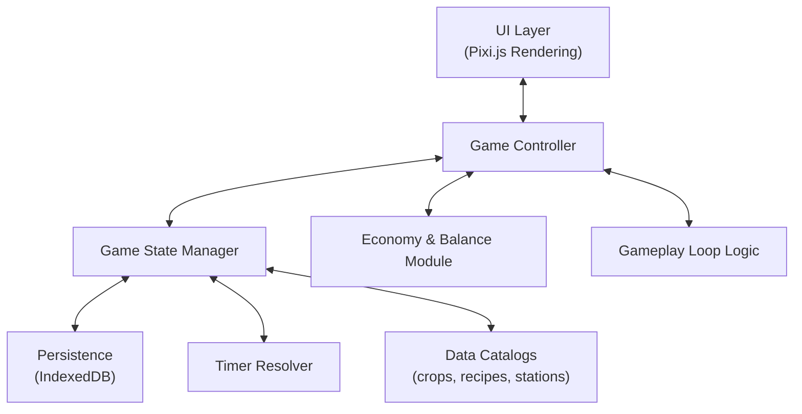

# 🏗️ Technical Architecture

## Overview

**Goal**: Define the technical foundation for the MVP
**Timeline**: Foundation for all development
**Target**: Scalable, maintainable, performant architecture

## High-Level System Diagram



## Core Modules

### 1. UI Layer

- **Built on Pixi.js**
- **Renders farm plots, stations, inventory, market**
- **Handles input: taps, drags, clicks**
- **Separate from logic: UI reads/writes via GameController API**

### 2. Game Controller

- **Orchestrates flow between UI and State**
- **Exposes clean methods**:
  - `plantCrop(plotId, cropId)`
  - `waterCrop(plotId)`
  - `harvestCrop(plotId)`
  - `startJob(stationId, recipeId)`
  - `sellItem(itemId, qty)`

### 3. Game State Manager

- **Holds in-memory representation of farm**
- **Normalizes data: plots, stations, jobs, inventory**
- **Syncs with persistence layer**

### 4. Persistence

- **IndexedDB (primary storage system)**
- **Stores: player, plots, stations, jobs, inventory, flags**
- **Versioned schema with migrations**

### 5. Timers

- **Core idle mechanic**:
  - Store planted_at / end_at
  - On load: resolve all expired timers
  - No background timers; "catch-up" on app open

### 6. Data Catalogs

- **Static JSON definitions for crops, recipes, stations**
- **Never written to by game**
- **Allows expansion by adding new entries**

### 7. Economy & Balance Module

- **Centralized formulas for pricing, XP rewards, yields**
- **Reads from catalogs, applies scaling curves**

### 8. Gameplay Loop Logic

- **Session flow (clean → plant → craft → sell)**
- **Implements onboarding/tutorial steps**
- **Encapsulates rules like watering bonuses or yield modifiers**

## Key Architecture Principles

### 1. Data-Driven Design

- **Crops, recipes, and items defined in JSON, not code**
- **Easy to expand by adding new entries**
- **No code changes needed for new content**

### 2. Separation of Concerns

- **UI handles visuals, State handles data, Controller mediates**
- **Clear boundaries between systems**
- **Easy to test and maintain**

### 3. Offline-First

- **No background timers; compute progress on open**
- **Full functionality without internet**
- **Reliable offline progress calculation**

### 4. Expandable

- **New crop = add JSON + art. No code rewrite**
- **Modular system design**
- **Easy to add new features**

### 5. Error-Resilient

- **Graceful handling of failures and player mistakes**
- **Robust error recovery**
- **Data validation and integrity**

### 6. Performance-Optimized

- **Efficient rendering, memory management, and battery usage**
- **60fps target on mobile devices**
- **Minimal resource usage**

### 7. Save-Robust

- **Reliable persistence with error handling and recovery systems**
- **Data integrity validation**
- **Graceful handling of save corruption**

## Data Structures

### Game State

```typescript
interface GameState {
	player: PlayerState;
	plots: PlotState[];
	inventory: InventoryState;
	economy: EconomyState;
	progression: ProgressionState;
	timers: TimerState[];
	flags: GameFlags;
}
```

### Plot State

```typescript
interface PlotState {
	id: string;
	position: { x: number; y: number };
	crop?: CropState;
	status: "empty" | "planted" | "growing" | "ready";
	plantedAt?: number;
	growthTime?: number;
}
```

### Crop State

```typescript
interface CropState {
	id: string;
	type: string;
	plantedAt: number;
	growthTime: number;
	watered: boolean;
	waterBonus: number;
}
```

### Timer State

```typescript
interface TimerState {
	id: string;
	type: "crop_growth" | "crafting" | "research";
	startTime: number;
	duration: number;
	completed: boolean;
}
```

## Technical Requirements

### Performance Targets

- **60fps on mobile devices**
- **<3 seconds initial load time**
- **<100ms action response time**
- **Minimal memory usage**

### Browser Compatibility

- **Modern browsers with IndexedDB support**
- **Mobile Safari and Chrome**
- **Progressive Web App capabilities**

### Offline Functionality

- **Full game functionality without internet**
- **Accurate offline progress calculation**
- **Reliable save/load system**

## Implementation Strategy

### Phase 1: Foundation

1. **Set up Pixi.js project structure**
2. **Implement basic game loop**
3. **Create game state management**
4. **Build save/load system**

### Phase 2: Core Systems

1. **Implement plot and crop systems**
2. **Build timer resolution system**
3. **Create economy and balance modules**
4. **Add dev tools system**

### Phase 3: Enhancement

1. **Add visual and audio systems**
2. **Implement progression system**
3. **Build market interface**
4. **Add statistics tracking**

### Phase 4: Polish

1. **Optimize for mobile devices**
2. **Implement performance monitoring**
3. **Add error handling and recovery**
4. **Final testing and validation**

## Success Criteria

### Technical Goals

- [ ] 60fps on mobile devices
- [ ] <3 seconds initial load
- [ ] Full offline functionality
- [ ] <5% crash rate

### Architecture Goals

- [ ] Modular, maintainable code
- [ ] Easy to add new content
- [ ] Robust error handling
- [ ] Scalable system design

### Development Goals

- [ ] Easy to test and debug
- [ ] Clear separation of concerns
- [ ] Comprehensive dev tools
- [ ] Reliable save system

## Deliverable

Scalable, maintainable, performant technical architecture

## Next Steps

1. Set up project structure and build system
2. Implement core game loop and state management
3. Build save/load system with IndexedDB
4. Create timer resolution system
5. Implement plot and crop systems
6. Add economy and balance modules
7. Build dev tools system
8. Test and validate architecture

## Dependencies

- **None** - This is the foundation

## Integration Points

- **All MVP versions**: Architecture supports all development
- **Future roadmaps**: Architecture enables all future features
- **Dev tools**: Architecture supports comprehensive debugging
