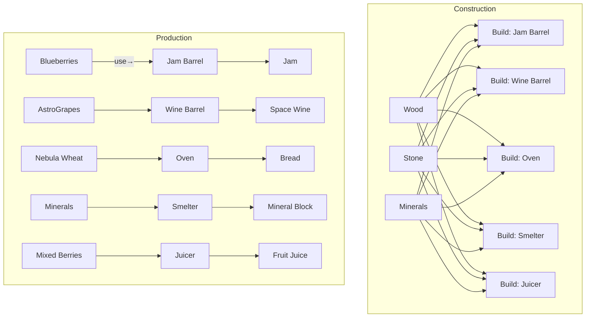

# Crafting

Two distinct pipelines:

1. Construction Crafting — build stations/tools (barrels, ovens, smelters).
2. Production Crafting — use stations to process crops → goods (jam, wine, etc.).



## Recipe Schemas

### Construction Recipe

```json
{
	"id": "build.jam_barrel",
	"display_name": "Build: Jam Barrel",
	"category": "construction",
	"inputs": { "electronic_components": 8, "power_cells": 4, "minerals": 2 },
	"time_minutes": 2,
	"result_station_id": "station.jam_barrel",
	"unlocks": ["prod.jam"]
}
```

### Production Recipe

```json
{
	"id": "prod.jam",
	"display_name": "Jam",
	"category": "production",
	"station_id": "station.jam_barrel",
	"inputs": { "crop.quantum_blueberry": 3 },
	"time_minutes": 15,
	"outputs": { "item.jam": 1 },
	"sell_price": 28,
	"xp_on_complete": 4
}
```

### MVP Stations (Construction)

| id                           | name                 | inputs                                              | time |
| ---------------------------- | -------------------- | --------------------------------------------------- | ---- |
| station.bio_processor        | Bio-Processor        | electronic components×8, power cells×4, minerals×2  | 2m   |
| station.fermentation_chamber | Fermentation Chamber | electronic components×12, power cells×6, minerals×3 | 3m   |
| station.synthesis_unit       | Synthesis Unit       | electronic components×10, minerals×5                | 3m   |
| station.molecular_forge      | Molecular Forge      | electronic components×12, minerals×8                | 4m   |
| station.extraction_unit      | Extraction Unit      | electronic components×6, minerals×6                 | 2m   |

### MVP Production (5 crafts)

| id                 | station     | inputs                                | time | output          | baseline sell |
| ------------------ | ----------- | ------------------------------------- | ---- | --------------- | ------------- |
| prod.jam           | Jam Barrel  | Quantum Blueberries×3 or Strawboids×3 | 15m  | Jam×1           | 28            |
| prod.space_wine    | Wine Barrel | AstroGrapes×3                         | 120m | Space Wine×1    | 110           |
| prod.bread         | Oven        | Nebula Wheat×2                        | 30m  | Bread×1         | 55            |
| prod.mineral_block | Smelter     | Minerals×5                            | 60m  | Mineral Block×1 | 70            |
| prod.fruit_juice   | Juicer      | Any berries×3                         | 20m  | Fruit Juice×1   | 35            |

> Design goal: crafted goods should beat raw margins by ~1.6×–2.2× while respecting time investment and station gating.

## Crafting Queue Model

- Each station holds one job at a time (MVP).
- Queue is per-station; jobs persist offline via end_at timestamps.
- On completion, move outputs to inventory and mark station idle.
