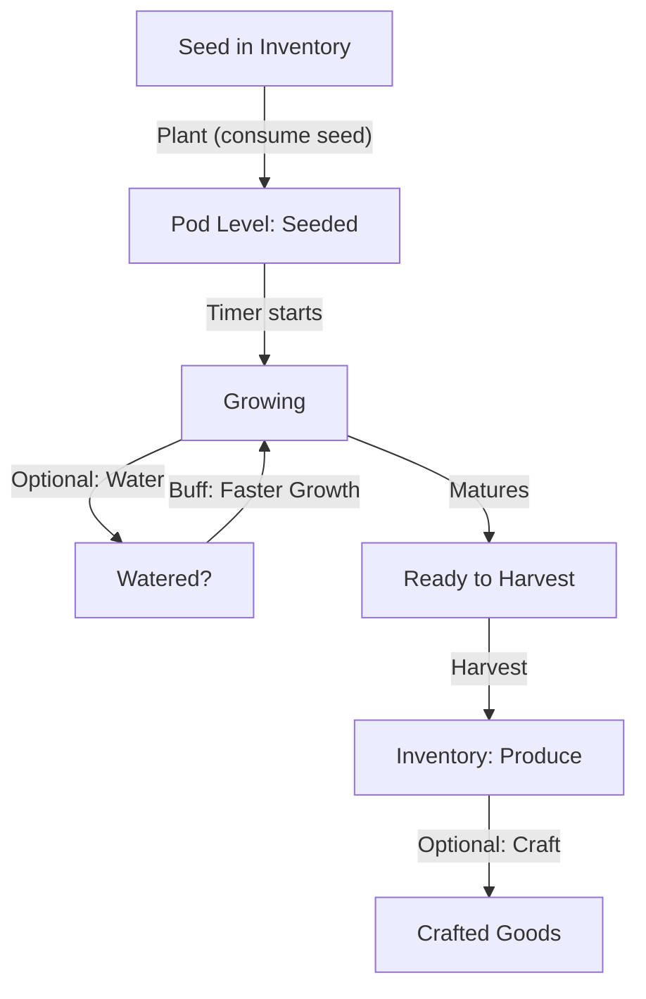

# Crops

Define a data-driven crop system that's easy to expand without touching core logic. Crops are declared in JSON, rendered by Pixi.js via art_key, and governed by timers that progress offline.

## Vertical Farm System

### Growing Pod Structure

- **Vertical Growing Chambers**: Each pod can have multiple growing levels (1-4+ levels)
- **Level Restrictions**: Some crops can only grow on certain levels due to size/space requirements
- **Research Unlocks**: Higher pod levels require research and materials to unlock
- **Environmental Control**: Each level has independent climate, lighting, and nutrient systems

### Crop Level Requirements

- **Compact Crops**: Can grow on any level (lettuce, potatoes, herbs)
- **Medium Crops**: Require 2+ levels (tomatoes, peppers, small fruits)
- **Large Crops**: Require 3+ levels (beans, corn, large fruits)
- **Tree Crops**: Require 4+ levels (fruit trees, large vegetables)

## Crop Lifecycle



## Crop Attributes (Schema)

```json
{
	"id": "crop.quantum_blueberry",
	"display_name": "Quantum Blueberries",
	"tier": 1,
	"growth_minutes": 5,
	"water_bonus": { "speed_pct": 20, "cap_pct": 30 },
	"yield": { "min": 1, "max": 2, "chance_bonus_watered_pct": 20 },
	"buy_price": 5,
	"sell_price_raw": 8,
	"planet_restrictions": ["earth_moon"],
	"season_restrictions": [],
	"xp_on_harvest": 2,
	"art_key": "crop_qblue",
	"vertical_requirements": {
		"min_levels": 2,
		"max_levels": 4,
		"preferred_level": 3
	},
	"environmental_needs": {
		"temperature": "moderate",
		"humidity": "high",
		"lighting": "full_spectrum"
	},
	"notes": "Glows faintly. May cause mild time dilation."
}
```

### Field Definitions:

- id: stable string ID (used in saves/recipes).
- growth_minutes: baseline real-world time to maturity.
- water_bonus.speed_pct: per-watering speedup (stack to cap_pct).
- yield: min/max; optional extra yield chance if watered.
- buy/sell: market baselines; tuned by economy doc later.
- planet_restrictions: which planets/moons this crop can grow on.
- season_restrictions: reserved for future (seasons).
- xp_on_harvest: progression hooks (optional in MVP).
- art_key: texture atlas key for Pixi.js.
- vertical_requirements: how many pod levels this crop needs.
- environmental_needs: sci-fi environmental requirements.

### Starter Crop Set (5)

| id                     | name                | tier | growth | buy | sell (raw) | yield | levels | planet | notes                      |
| ---------------------- | ------------------- | ---- | ------ | --- | ---------- | ----- | ------ | ------ | -------------------------- |
| crop.quantum_blueberry | Quantum Blueberries | 1    | 5m     | 5   | 8          | 1–2   | 2-4    | earth  | Starter berry for Jam      |
| crop.strawboid         | Strawboids          | 1    | 7m     | 6   | 9          | 1–2   | 1-3    | earth  | Juicing bonus              |
| crop.plasmato          | Plasmatoes          | 2    | 30m    | 18  | 28         | 2–3   | 3-4    | earth  | Higher margin, needs space |
| crop.astro_grape       | AstroGrapes         | 2    | 45m    | 25  | 40         | 1–2   | 4      | earth  | Wine production, tree-like |
| crop.nebula_wheat      | Nebula Wheat        | 1    | 60m    | 12  | 20         | 3–4   | 1-2    | earth  | Bread production, compact  |

## Environmental Systems

### Climate Control

- **Temperature Zones**: Each pod level can have different temperature settings
- **Humidity Control**: Automated misting systems for optimal growth
- **Lighting Systems**: LED grow lights with different spectrums for different crops
- **Nutrient Delivery**: Hydroponic systems with automated nutrient mixing

### Research Unlocks

- **Pod Level Expansion**: Research to unlock 5th, 6th, 7th levels
- **Environmental Upgrades**: Better climate control, lighting, nutrient systems
- **Crop Optimization**: Research to improve yield, growth speed, or environmental tolerance
- **Cross-Planet Crops**: Research to grow crops from other planets on current location
  | crop.plasmato | Plasmatoes | 2 | 30m | 18 | 28 | 1 | Slightly radioactive (flavor) |
  | crop.astro_grape | AstroGrapes | 2 | 45m | 22 | 35 | 1–2 | Used for Space Wine |
  | crop.nebula_wheat | Nebula Wheat | 2 | 60m | 20 | 30 | 1 | Used for Bread |

Balancing note (MVP): aim for ~1.5×–2× sell/buy on raw crops, leaving extra margin for crafted goods.

### JSON Catalog Example

```json
{
	"crops": [
		{
			"id": "crop.quantum_blueberry",
			"display_name": "Quantum Blueberries",
			"tier": 1,
			"growth_minutes": 5,
			"water_bonus": { "speed_pct": 20, "cap_pct": 30 },
			"yield": { "min": 1, "max": 2, "chance_bonus_watered_pct": 20 },
			"buy_price": 5,
			"sell_price_raw": 8,
			"planet_restrictions": [],
			"season_restrictions": [],
			"xp_on_harvest": 2,
			"art_key": "crop_qblue"
		},
		{
			"id": "crop.strawboid",
			"display_name": "Strawboids",
			"tier": 1,
			"growth_minutes": 7,
			"water_bonus": { "speed_pct": 15, "cap_pct": 30 },
			"yield": { "min": 1, "max": 2, "chance_bonus_watered_pct": 15 },
			"buy_price": 6,
			"sell_price_raw": 9,
			"planet_restrictions": [],
			"season_restrictions": [],
			"xp_on_harvest": 2,
			"art_key": "crop_strawboid"
		},
		{
			"id": "crop.plasmato",
			"display_name": "Plasmatoes",
			"tier": 2,
			"growth_minutes": 30,
			"water_bonus": { "speed_pct": 10, "cap_pct": 20 },
			"yield": { "min": 1, "max": 1 },
			"buy_price": 18,
			"sell_price_raw": 28,
			"planet_restrictions": [],
			"season_restrictions": [],
			"xp_on_harvest": 4,
			"art_key": "crop_plasmato"
		},
		{
			"id": "crop.astro_grape",
			"display_name": "AstroGrapes",
			"tier": 2,
			"growth_minutes": 45,
			"water_bonus": { "speed_pct": 10, "cap_pct": 20 },
			"yield": { "min": 1, "max": 2 },
			"buy_price": 22,
			"sell_price_raw": 35,
			"planet_restrictions": [],
			"season_restrictions": [],
			"xp_on_harvest": 4,
			"art_key": "crop_astrogrape"
		},
		{
			"id": "crop.nebula_wheat",
			"display_name": "Nebula Wheat",
			"tier": 2,
			"growth_minutes": 60,
			"water_bonus": { "speed_pct": 10, "cap_pct": 20 },
			"yield": { "min": 1, "max": 1 },
			"buy_price": 20,
			"sell_price_raw": 30,
			"planet_restrictions": [],
			"season_restrictions": [],
			"xp_on_harvest": 4,
			"art_key": "crop_nebulawheat"
		}
	]
}
```

### Growth Calculations (MVP)

- `effective_growth = growth_minutes × (1 - min(water_stacks × speed_pct, cap_pct)/100)`
- On app open, compute remaining time by max(0, planted_at + effective_growth - now).
