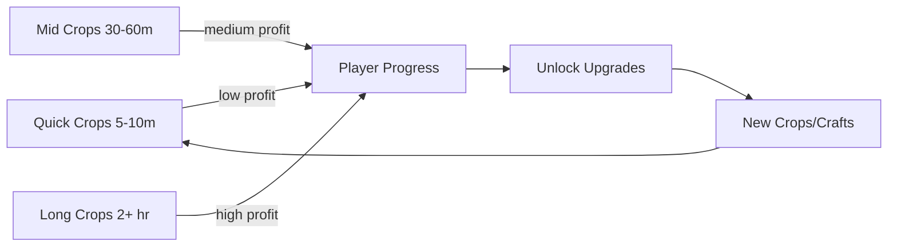

# Economy

## Design Philosophy

- Fun-first, not exploit-first: no engagement traps.
- Short crops → quick dopamine hits.
- Long crops/crafts → bigger payoffs.
- Crafting should outperform raw selling by ~1.6×–2.2×.
- Upgrades should scale exponentially but remain achievable.

## Currency

**Credits**: main soft currency.

- Earned by selling crops & goods.
- Spent on seeds, tools, and land expansion.

## Pricing Rules

### Crops

- Sell value = ~1.5× buy price.
- Example: Buy 5 → Sell 8.

### Crafted Goods

- Value = ~2×–3× input crop value (adjusted for time).
- Example: 3 berries @8 each = 24 → Jam sells for 28 (1.16× raw) → but craft time is only 15m → good ROI.

### Resources

- Wood/Stone/Minerals → gathered via farm cleanup.
- Used for construction recipes only (non-sellable in MVP).

## Upgrade Costs

- Upgrades scale exponentially to encourage long-term play.
- Plot expansions: ~×2 cost per expansion.
- Station builds: start cheap, scale with more stations.

### Upgrade Costs Table

| Upgrade     | Base Cost                    | Scale                      |
| ----------- | ---------------------------- | -------------------------- |
| New Plot    | 20 credits                   | ×2 per plot                |
| Jam Barrel  | wood×8, stone×4, minerals×2  | +20% mats per extra barrel |
| Wine Barrel | wood×12, stone×6, minerals×3 | +20% mats per barrel       |

## Example Economy Table (MVP)

| Item              | Inputs       | Growth/Craft Time | Sell Price | Notes              |
| ----------------- | ------------ | ----------------- | ---------- | ------------------ |
| Quantum Blueberry | seed (5 cr)  | 5m                | 8 cr       | Starter crop       |
| Strawboid         | seed (6 cr)  | 7m                | 9 cr       | Starter crop       |
| Plasmato          | seed (18 cr) | 30m               | 28 cr      | Higher margin      |
| Jam               | 3 berries    | 15m               | 28 cr      | Beats raw by ~15%  |
| Space Wine        | 3 grapes     | 120m              | 110 cr     | High-value idle    |
| Bread             | 2 wheat      | 30m               | 55 cr      | Mid-tier craft     |
| Mineral Block     | 5 minerals   | 60m               | 70 cr      | Value from mining  |
| Fruit Juice       | 3 berries    | 20m               | 35 cr      | Alternative to jam |

## XP & Progression

Each harvest/craft grants XP.

Level-ups can:

- Unlock new crops.
- Improve yield chances.
- Reduce craft/build times slightly.

## Economy Balancing Graph

## Future Economy Hooks

- Dynamic Market → fluctuating prices.
- Event Multipliers → "Double jam sales this week!"
- NPC Buyers → special deals & personality quirks.
