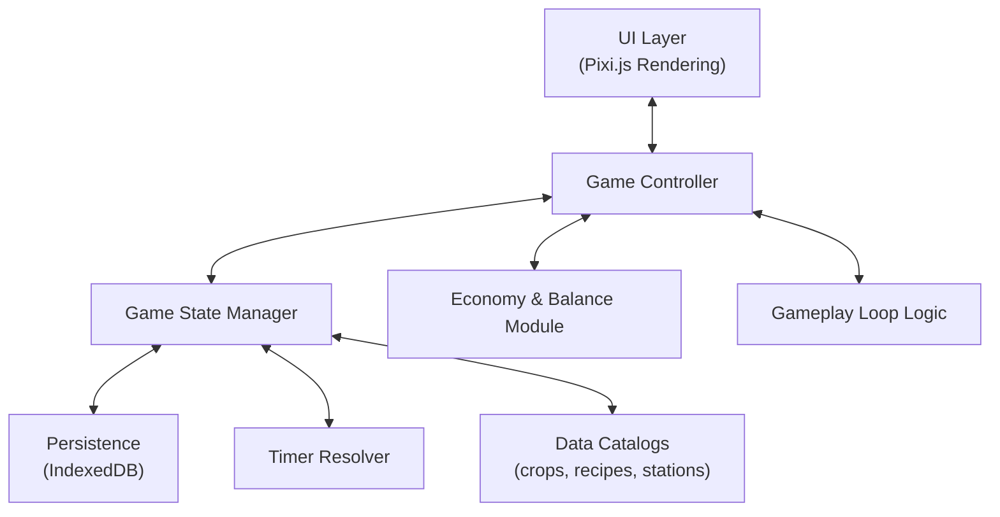

# Game Architecture

## High-Level System Diagram

## Core Modules

1. UI Layer
   1. Built on Pixi.js
   2. Renders farm plots, stations, inventory, market
   3. Handles input: taps, drags, clicks
   4. Separate from logic: UI reads/writes via GameController API

2. Game Controller
   1. Orchestrates flow between UI and State
   2. Exposes clean methods:
      - plantCrop(plotId, cropId)
      - waterCrop(plotId)
      - harvestCrop(plotId)
      - startJob(stationId, recipeId)
      - sellItem(itemId, qty)

3. Game State Manager
   1. Holds in-memory representation of farm
   2. Normalizes data: plots, stations, jobs, inventory
   3. Syncs with persistence layer

4. Persistence
   1. IndexedDB (primary storage system)
   2. Stores: player, plots, stations, jobs, inventory, flags
   3. Versioned schema with migrations

5. Timers
   1. Core idle mechanic:
      - Store planted_at / end_at
      - On load: resolve all expired timers
      - No background timers; "catch-up" on app open

6. Data Catalogs
   1. Static JSON definitions for crops, recipes, stations
   2. Never written to by game
   3. Allows expansion by adding new entries

7. Economy & Balance Module
   1. Centralized formulas for pricing, XP rewards, yields
   2. Reads from catalogs, applies scaling curves

8. Gameplay Loop Logic
   1. Session flow (clean → plant → craft → sell)
   2. Implements onboarding/tutorial steps
   3. Encapsulates rules like watering bonuses or yield modifiers

## Key Architecture Principles

1. Data-Driven Design → Crops, recipes, and items defined in JSON, not code
2. Separation of Concerns → UI handles visuals, State handles data, Controller mediates
3. Offline-First → No background timers; compute progress on open
4. Expandable → New crop = add JSON + art. No code rewrite
5. Error-Resilient → Graceful handling of failures and player mistakes
6. Performance-Optimized → Efficient rendering, memory management, and battery usage
7. Save-Robust → Reliable persistence with error handling and recovery systems
