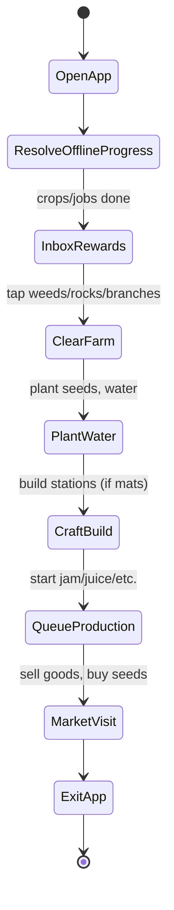

# Player Promise

- 5–10 minute sessions always yield progress: harvests ready, jobs complete, market actions meaningful.
- Early loop is hands-on (cleaning + planting); midgame adds production planning.

## Session Flow (Early Game)

## Session Flow (Mid Game)

- Fewer cleanups; more station juggling and plot planning.
- Decide between short recipes (check again soon) vs long recipes (check later).

## Expected Timings (MVP)

- Crop growth: 5m / 7m / 30m / 45m / 60m (per crop table).
- Production: 15m / 20m / 30m / 60m / 120m (per recipe table).
- Construction: 2–4m (station build times).

## Player Onboarding (MVP)

Intro popups:

- Clean debris → gain electronic components/power cells/minerals.
- Buy seeds → plant → water.
- First harvest triggers Jam Barrel tutorial.
- Sell Jam → buy more seeds → build second station.

## Failure/Edge Handling

- Inventory full → move outputs to an Inbox tab (collect on open).
- No seeds → nudge to Market.
- No storage types → keep simple (unified inventory) for MVP.
