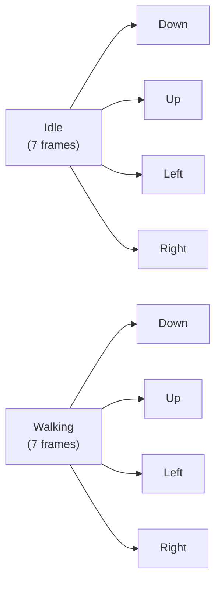
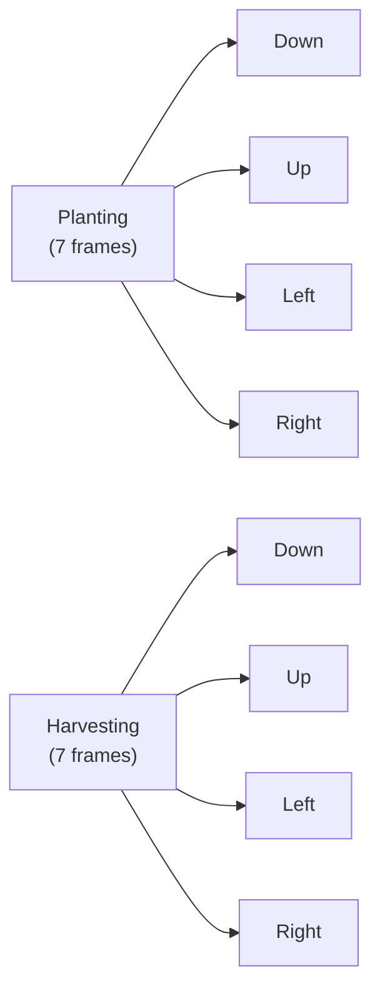
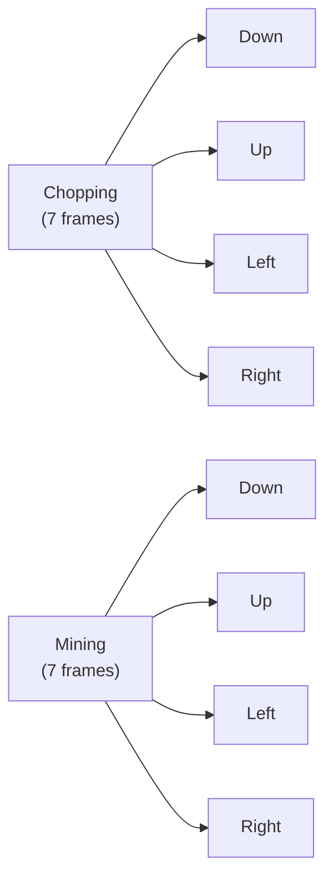

# Sprite Technical Design Document

## Overview

The main character is rendered as a 16-bit pixel-art farmer, with Futurama-inspired humor (quirky expressions, slightly goofy proportions). Animations are simple, 7-frame loops for each action and direction.

## Sprite Sheet Layout

### Global Rules

- **Frame size**: 32×32 px (scales well for mobile)
- **Grid arrangement**:
  - Rows = actions × directions
  - Columns = frames (7)
- **Total sheet size for MVP**: 224px wide × 768px tall (24 rows)
  - Width: 32 × 7 = 224px
  - Height: 32 × 24 = 768px

## Actions & Directions

### 1. Idle Motion

- Subtle bobbing or blinking
- **Frames**: head tilt, slight sway, blinking eyes

### 2. Walking

- Classic left/right stepping cycle
- **Animation**: arm swing, light bounce

### 3. Planting

- Kneel slightly, drop seed, small dirt puff

### 4. Harvesting

- Bend forward, tug motion, pull item up
- **Optional**: sparkle when crop pops

### 5. Chopping

- Raise axe, swing down
- **Effect**: small "impact" frame (wood chip effect)

### 6. Mining

- Pickaxe raised, swing down
- **Effect**: rock debris particles (FX)

### Directions

- **Down**: Facing forward (toward player)
- **Up**: Back of head, shoulders visible
- **Left/Right**: Side view

Each action repeats for all 4 directions.

## Animation Mapping

### Basic Movement Actions



### Farming Actions



### Resource Gathering Actions



## JSON Animation Manifest

This JSON tells your engine how to slice the sprite sheet:

```json
{
	"character": {
		"frame_size": { "w": 32, "h": 32 },
		"actions": {
			"idle": {
				"frames": 7,
				"directions": ["down", "up", "left", "right"],
				"fps": 6,
				"loop": true
			},
			"walk": {
				"frames": 7,
				"directions": ["down", "up", "left", "right"],
				"fps": 8,
				"loop": true
			},
			"plant": {
				"frames": 7,
				"directions": ["down", "up", "left", "right"],
				"fps": 6,
				"loop": false
			},
			"harvest": {
				"frames": 7,
				"directions": ["down", "up", "left", "right"],
				"fps": 6,
				"loop": false
			},
			"chop": {
				"frames": 7,
				"directions": ["down", "up", "left", "right"],
				"fps": 6,
				"loop": true
			},
			"mine": {
				"frames": 7,
				"directions": ["down", "up", "left", "right"],
				"fps": 6,
				"loop": true
			}
		}
	}
}
```

## Humor & Flavor Ideas

- **Idle**: Character occasionally sneezes from "space dust"
- **Planting**: Seeds glow briefly before vanishing
- **Harvesting**: Surprised look when pulling out giant crop
- **Chopping**: Axe sparks comically when hitting rocks
- **Mining**: Character gets "startled" animation if a rock wiggles
