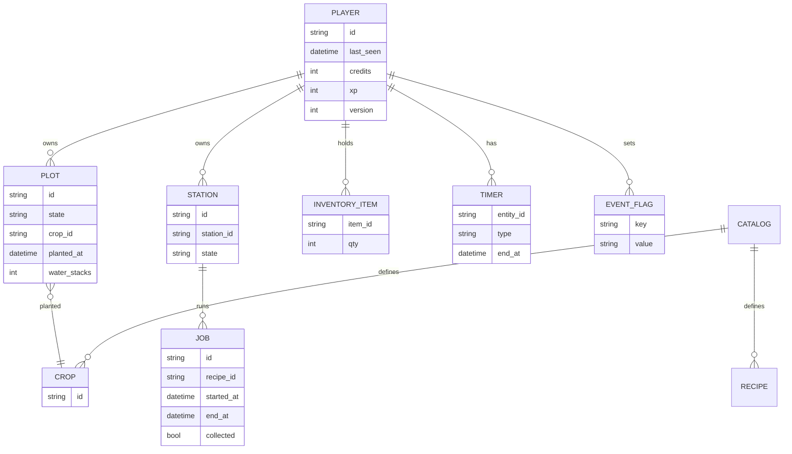

# Storage

## Goals

- Offline-first persistence (IndexedDB preferred; LocalStorage fallback for small data).
- Versioned schema with simple migrations.
- Data-driven content (JSON catalogs) separate from save state.

## High-Level Store Map



### IndexedDB Stores (MVP)

- player: single record (credits, xp, last_seen, version).
- plots: array of plots.
- stations: player-owned stations & their current job.
- inventory: key→qty (items, seeds, materials, goods).
- jobs: active/finished crafting jobs.
- flags: misc booleans (tutorials shown, etc.).
- catalog: loaded at runtime from static JSON (/data/\*.json).

### Save/Load Mechanics

- On load:
  1. Read last_seen.
  2. For each plot/job, compute elapsed time and resolve completions.
  3. Credit outputs and set new states.

### Timestamp Strategy

- Store absolute UTC ISO strings.
- No reliance on background timers; recompute on foreground.

### Example Save Snippets

```json
{
	"player": {
		"id": "p1",
		"credits": 120,
		"xp": 0,
		"last_seen": "2025-09-05T14:12:00Z",
		"version": 1
	},
	"plots": [
		{
			"id": "plot_01",
			"state": "growing",
			"crop_id": "crop.quantum_blueberry",
			"planted_at": "2025-09-05T14:05:00Z",
			"water_stacks": 1
		}
	],
	"stations": [
		{ "id": "st_jam_01", "station_id": "station.jam_barrel", "state": "idle" }
	],
	"inventory": [
		{ "item_id": "seed.quantum_blueberry", "qty": 4 },
		{ "item_id": "wood", "qty": 12 },
		{ "item_id": "stone", "qty": 6 }
	],
	"jobs": []
}
```

## Versioning & Migrations

- Add `player.version`.
- On version change, run small transforms (e.g., initialize new fields, map old IDs).
- Keep catalogs backward-compatible; use “deprecation” flags when needed.
